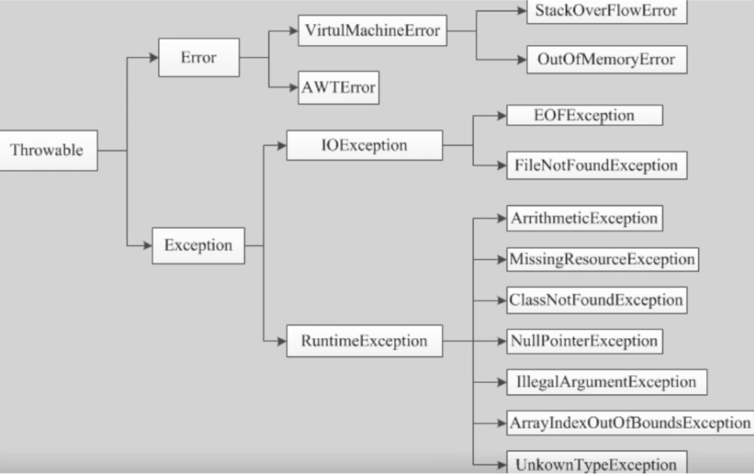

### 异常
1.异常分类


2.异常关键字
- try
- catch
- finally
- throw
- throws

3.捕获异常
```java
try{
    //可能发生异常的代码
}catch(ExceptionName varName){
    //若捕获则执行
}finally{
    //无论是否捕获均执行
}
```

4.抛出异常
```java
public void func(var...) throws ExceptionName{
    throw new ExceptionName();
        }
```

5.自定义异常
- 自定义异常类
```java
public class MyException extends Exception{ }
```